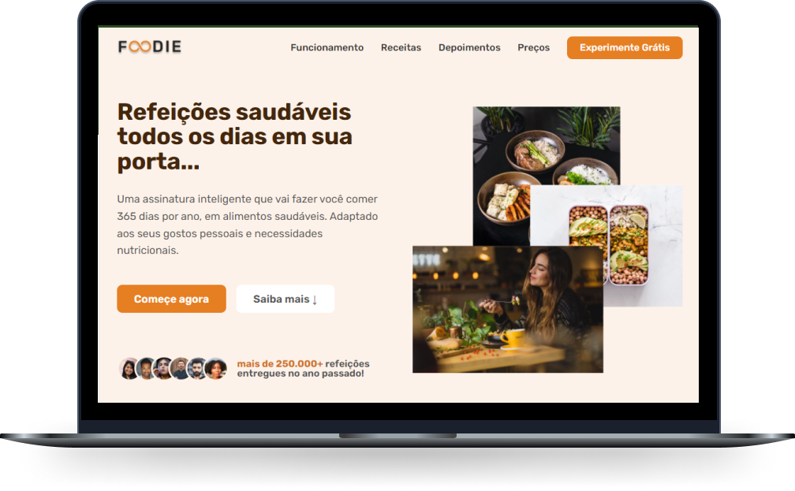

<h1 align="center">
  
</h1>

  <a href="#-tecnologias">Tecnologias</a>&nbsp;&nbsp;&nbsp;|&nbsp;&nbsp;&nbsp;
  <a href="#-projeto">Projeto</a>

 

  

 

## 🚀 Tecnologias

Esse projeto foi desenvolvido com as seguintes tecnologias:

- HTML
- CSS
- JavaScript

 

## 💻 Projeto

Este projeto é uma página de serviços de alimentação fictício da marca Foodie.
O Foodie é uma aplicação de assinatura de alimentos com inteligência artificial que fará você comer saudável durante 365 dias por ano. É adaptado aos seus gostos pessoais e necessidades nutricionais.
